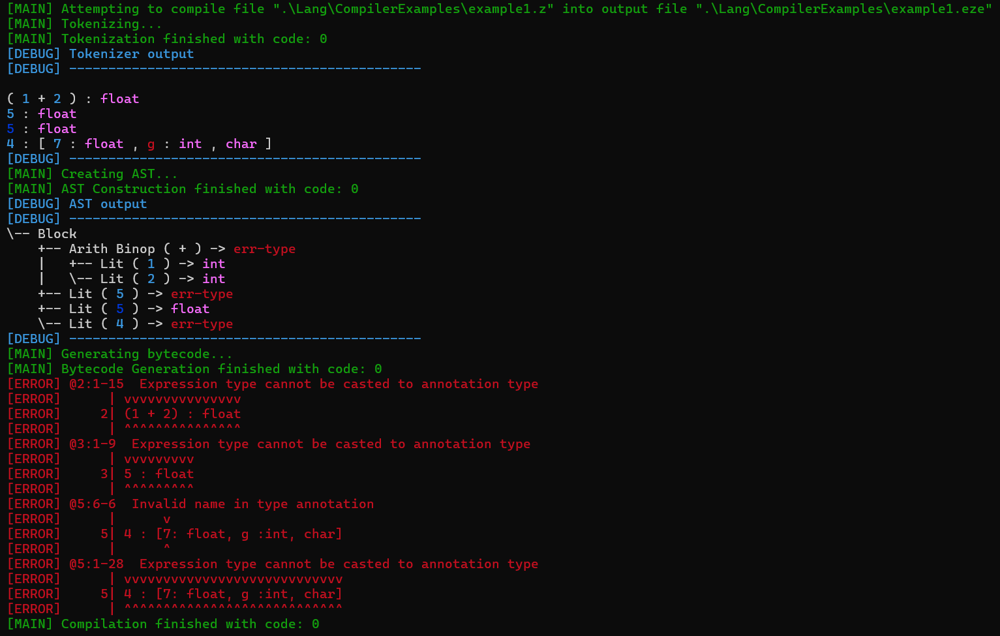

# Zed
Zed, a custom programming language compiled to a bytecode and run on a VM. The compiler, vm, assembler, and disassembler are all written in C++

## Why?

***It's interesting.*** I feel like wanting to design their own programming language is a phase many programmers go through. This is that for me. A little bit of creativity, and a project that is mine, top to bottom.

***It's a learning project.*** Before starting, I knew almost nothing about: C++, instruction set architectures, assembly languages, parsing, compiling, linking, or programming language design. Now I know quite a bit, and there's more to come.

***It requires problem solving.*** I love problem solving. And I'm making a deliberate effort to only research the big ideas, so that I can find my own solutions to all of the implementation details.

***It's not meant to be practical.*** I'm sure nothing meets production-level design standards, and there are a lot of mistakes, and it's by no means efficient. That's not the point, and criticism to that effect is moot.

## Running It
This is a project in Microsoft Visual Studio. After opening the Project/Solution you can build and run using the IDE. There is no CMake or cross-platform build tool (other than Visual Studio itself) set up currently.

### Command Line Arguments

| Commands/Options | General Arguments | Description |
| ---------------- | --------- | ----------- |
|    `-h`, `--help`          | none                       | display this help information                       |
|    `-d`, `--debug`         | none                       | set debug mode for all following commands           |
|    `/e`, `/execute`        | path to .eze               | execute a .eze executable                           |
|    `/a`, `/assemble`       | path to .azm, path to .eze | assemble a .azm file into a .eze executable         |
|    `/d`, `/disassemble`    | path to .eze               | disassemble a .eze executable                       |
|    `/c`, `/compile`        | path to .z, path to .eze   | compile a .z file into a .eze executable            |

Some commands have other optional inputs. For specific command help, use the help option under the command, for example `zed.exe /compile --help` (although currently many such messages are "TODO". Sorry!)

### Examples

The following arguments would assemble the [guessing game example](Zed/Lang/AssemblyExamples/guessing_game.azm) and immediately execute the file with `--memcheck` on.
```shell
# shorthand
zed.exe -d /a "./Lang/AssemblyExamples/guessing_game.azm" "./Lang/AssemblyExamples/example1.eze" /e "./Lang/CompilerExamples/example1.eze" -m
# full command
zed.exe --debug /assemble --in "./Lang/AssemblyExamples/guessing_game.azm" --out "./Lang/AssemblyExamples/example1.eze" /execute --in "./Lang/CompilerExamples/example1.eze" --memcheck
```

The following arguments would compile an example file.
```shell
zed.exe /c "./Lang/CompilerExamples/example1.z" "./Lang/CompilerExamples/example1.eze"
```

## Overview

### Bytecode/Virtual Machine
The bytecode is a RISC assembly-like language that comes with an assembler, disassembler, and executor (virtual machine). It is deliberately simplistic and tailored to a text-based interface. It supports operations on 32-bit ints, 32-bit floats, 8-bit chars, and 8-bit booleans, as well as standard conditionals and jumps.

Examples are in [Zed/Lang/AssemblyExamples](Zed/Lang/AssemblyExamples). For the best examples, see [fibonacci_recursive.azm](Zed/Lang/AssemblyExamples/fibonacci_recursive.azm) (shows use of stack frames) and [guessing_game.azm](Zed/Lang/AssemblyExamples/guessing_game.azm) (shows user input and number parsing).

### Compiler

#### Steps
1. **Tokenization**: Raw text is parsed into tokens, including literals, identifiers, keywords, and symbols/operators
2. **Pattern Matching**: Tokens are matched into a tree structure using a set of patterns. This step is very lenient, with minimal checking of correctness or type, which forces the patterns (and thus the language) to be generally consistent and unambiguous.
3. **Tree Formation**: The tree of matched patterns is turned into an Abstract Syntax Tree (AST), including symbol resolution and typechecking.
4. **Bytecode Generation**: Work in progress...
5. **Error Reporting**: Errors (at various levels, including warnings and informational messages) are reported, with information on where in the file they came from.

#### Example Output


## File Structure

```
├───Lang
│   │   grammar.md
│   │
│   ├───AssemblyExamples
│   │       babylonian_sqrt.azm/.eze
│   │       example1.azm/.eze
│   │       fibonacci_fast.azm/.eze
│   │       fibonacci_recursive.azm/.eze
│   │       guessing_game.azm/.eze
│   │       simple_user_input.azm/.eze
│   │
│   └───CompilerExamples
│           design.z
│           example1.z/.eze
│           tokenstest.z
│
├───assembler
│       assembler.cpp/.h
│
├───compiler
│       ast.cpp/.h
│       compiler.cpp/.h
│       gen.cpp/.h
│       nodes.cpp/.h
│       patterns.cpp/.h
│       tokenizer.cpp/.h
│       treeform.cpp/.h
│
├───disassembler
│       disassembler.cpp/.h
│
├───main
│       argparse.cpp/.h
│       main.cpp/.h
│
├───utils
│       bytecode.cpp/.h
│       code_location.h
│       flags.h
│       io_utils.h
│       opcode.h
│       string_lookup.h
│       utils.cpp
│
└───vm
        executor.cpp/.h
```

### Lang

The [Lang](Zed/Lang) folder contains:
- [AssemblyExamples](Zed/Lang/AssemblyExamples), which are well-formed examples of assembly code in `.azm` files. 
- [CompilerExamples](Zed/Lang/CompilerExamples), which are examples of code in `.z` files, but since the language design and compiler are works in progress these are used for live testing and are often disorganized or ill-formed.
- Various other ideas for language design that may or may not be incorporated.

### utils

The [utils](Zed/utils) folder contains utilities used across all of the major components.

### main

The [main](Zed/main) folder contains the entry point, and a simple command line argument parser.

### vm

The [vm](Zed/vm) contains the executor, which reads and runs `.eze` files.

### assembler

The [assembler](Zed/assembler) contains the assembler, which assembles `.azm` files into `.eze` bytecode.

### disassembler

The [disassembler](Zed/disassembler) contains the disassembler, which disassembles `.eze` bytecode into somewhat readable `.azm` code.

### compiler

The [compiler](Zed/compiler) folder contains a majority of the complex work of the project, which involves compiling `.z` files into `.eze` files.
- [compiler.cpp/.h](Zed/compiler/compiler.h) is the entry point for the compiler, and contains minimal logic of its own.
- [tokenizer.cpp/.h](Zed/compiler/tokenizer.h) defines token types and parses raw bytes from a file into a list of tokens.
- [nodes.cpp/.h](Zed/compiler/nodes.h) defines abstract syntax tree nodes, and their general utility functions (like printing).
- [patterns.cpp/.h](Zed/compiler/patterns.h) defines patterns for matching certain structures in the list of tokens, and using them to build a tree.
- [treeform.cpp/.h](Zed/compiler/treeform.h) defines functions for turning the tree of matches into an abstract syntax tree, including resolving types and variable bindings.
- [gen.cpp/.h](Zed/compiler/gen.h) defines functions for generating bytecode from an abstract syntax tree.